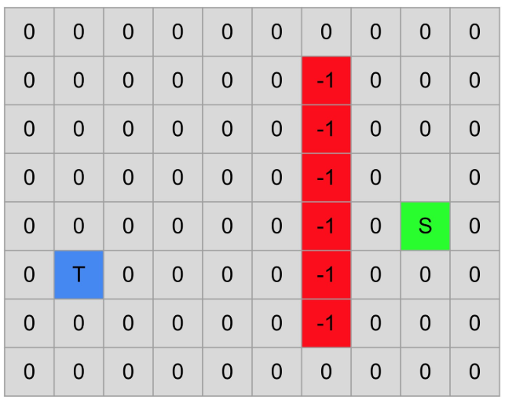
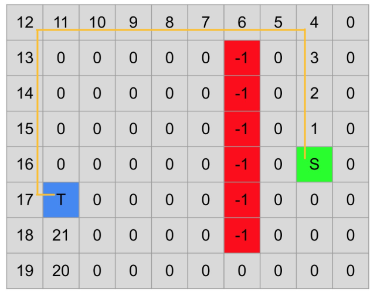

** Search Algorithms in a Grid Environment and Path-finding**

` `**Artificial Intelligence**

**Introduction**

Explore the world of search algorithms in a grid-based environment. In this Assignment, you will implement different search strategies to navigate from a starting cell to a target cell, while encountering obstacles and open paths. This hands-on exercise aims to deepen your understanding of the fundamental search algorithms frequently employed in Artificial Intelligence. This project also involves determining the shortest path based on the search algorithm you use for exploring the route.

**Code Structure**

You’ll be given a code template containing the SearchAlgorithms class. Your task is to fill in the methods corresponding to each search algorithm and ensure they return both the status of the target’s discovery and the final state of the grid. Also show the shortest path find by algorithm. 

**Uniform cost search():** Implement the Uniform Search algorithm with strict expanded list version. **dfs():** Implement the DepthFirst Search algorithm.

**bfs():** Implement the BreadthFirst Search algorithm.

**best first():** Implement the Best First Search algorithm, based on a heuristic you design or choose. Manhattan distance as the heuristic.

**a star():** Implement the A Search algorithm, combining both cost and heuristic (Manhattan distance).

For algorithms that use a priority queue, utilize the heapq module from Python’s standard library to manage the queue efficiently. The grid is represented as a list of lists, containing:

- s: Starting position.
- t: Target or goal position.
- 0: Empty cells that you can traverse.
- -1: Walls or obstacles that you cannot traverse.

As you traverse the grid, mark the order of cells you visit by replacing the 0s with consecutive numbers. The starting and target positions, represented by s and t, should remain unchanged.

**Requirements**

1. Follow the provided class and method names precisely. 
1. The function signatures or class names must not be altered.
1. Use the Manhattan distance as the heuristic for the Best First and  A\* Algorithms
1. Utilize the heapq module for implementing priority queues in applicable
1. algorithms.
1. Each search algorithm function must return a tuple containing two elements: a numeric indicator and the final state of the grid. The numeric indicator should be 1 if the target is found, and -1 if it is not found. 
1. The final state of the grid should display the marked cells according to the path found by the search algorithm. For instance, if the target is found, the function could return (1, grid), where 1 represents the successful search and grid represents the final state of the board.
1. When adding to your queue or stack, follow this order: **Right, Down, Left, Up, or the reverse.** The order can be reversed as well.
1. Return the shortest path from the source to the target using a list of tuples.
1. You Must **show the output Grid in Graphical User Interface** , one sample example is given below. 

**Example**

Below is an example grid before and after applying the DFS algorithm:

The board after applying DFS. The returned value is 1 and the final state of the board is displayed. Note that DFS is LIFO, so we explore up, left, down, right.

